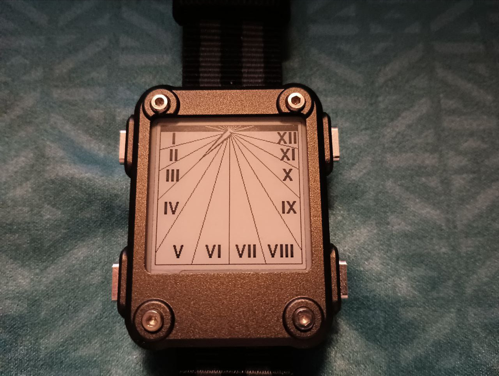
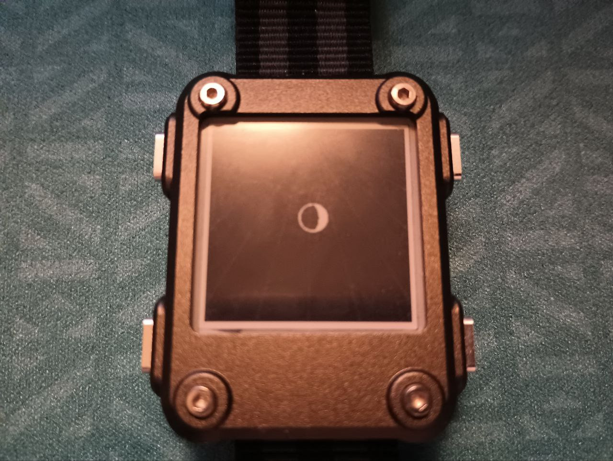
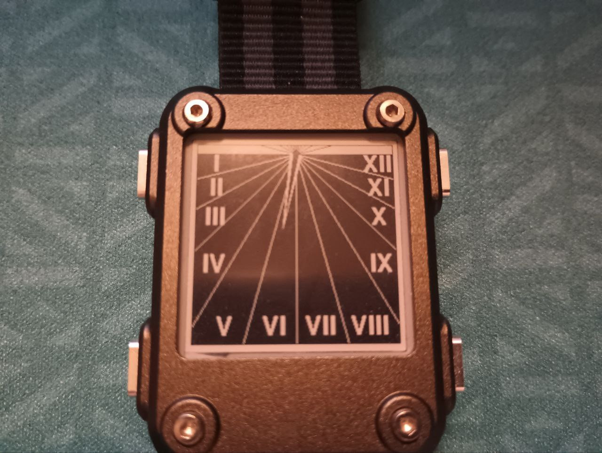
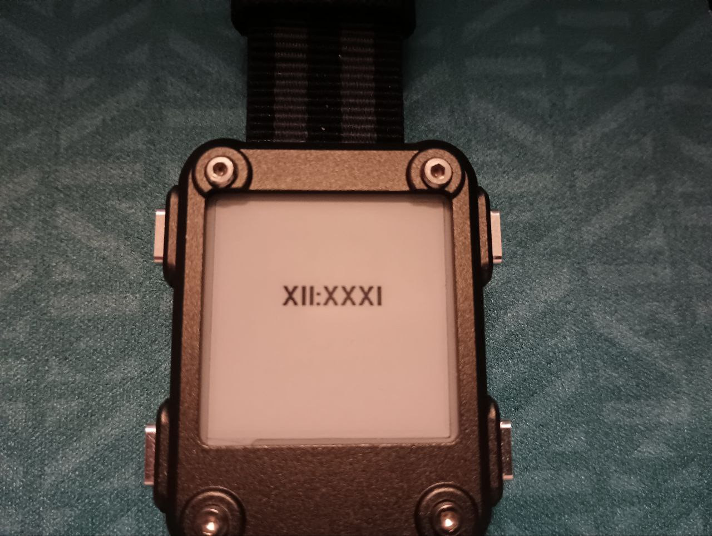
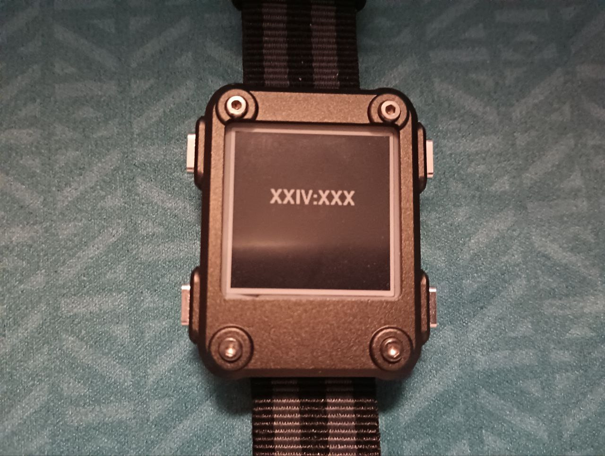

# watchy_romantime

This is another temporal hours clock - the romans had 12 between Sunrise and Sunset, and 12 between Sunset and Sunrise.

Tested with Watchy 1.4.10

Tools >> Manage Libraries >> Add "Sunset" (tested with 1.1.7)

There are 3 modes, which can be switched between by the right buttons; (TO FIX)

Mode 1, suggested by [@maya@occult.institute](https://occult.institute/@maya)

 

Mode 2, 

 

Mode 3, When you don't want to forsake modernity as much

 

Based on https://romanti.me/ by [@wilbr@glitch.social](https://glitch.social/@wilbr)

https://en.wikipedia.org/wiki/Roman_timekeeping

